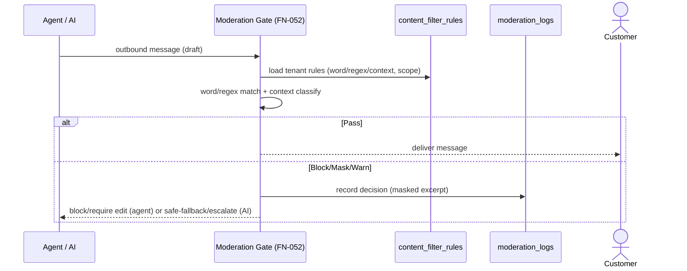

# IVY TalkTalk — Agent Management & Response Moderation (상담원 관리·응답 모더레이션)

상담원 등록/배정/통계와, **상담원·AI 발신 응답이 고객에게 전달되기 전 반드시 통과하는 모더레이션 필터**(불용어/금칙 + 문맥)를 정의한다.

## 1. New Functional Requirements (신규 요구사항)

| ID | Requirement | Priority |
|----|-------------|----------|
| FR-066 | **Agent registration & profile** (상담원 등록·프로필): 상담원=상담 라벨 보유 유저. 프로필(언어, 스킬/카테고리, 동시 처리 한도, 상태 online/away/offline). Master/Director가 등록·관리 | P0 |
| FR-067 | **Assignment & routing** (배정·라우팅): 신규/에스컬레이션 대화의 자동 라우팅(언어·스킬·부하 기반) + 수동 배정/이관, 대기열, 재배정 | P0 |
| FR-068 | **Consult statistics** (상담 통계): 상담원·팀별 처리건수·평균 응답/처리시간·해결률·에스컬레이션율·CSAT·온라인시간, 기간/필터 | P0 |
| FR-069 | **Outbound response moderation** (응답 모더레이션 필터): 상담원·AI의 **모든 발신 메시지**는 전달 전 필터 통과. **단어(불용어/금칙) + 문맥** 기반. 동작=차단/마스킹/경고(수정요구)/자동순화. 테넌트별 룰셋, 다국어, 감사 | P0 |

**NFR-013** 모더레이션 신뢰성·지연: 필터는 발신 경로의 **필수 게이트**(우회 불가); 목표 지연 추가 < 1s; **fail-safe = 필터 오류 시 자동 통과 금지(보류/차단)**; 모든 차단 감사.

## 2. Agent Management (상담원 관리)

### 2.1 Registration & Profile (FR-066)
- 상담원 = `users`(rank any) + **상담(consult) 라벨**. `agent_profiles`로 확장: 언어(en/es/ko), 스킬 태그(예: 배송/환불/제품), 동시 처리 한도(max_concurrent), 상태(online/away/offline).
- 등록/수정: Master/Director(SCR-208). 비활성/정지 시 라우팅 제외.

### 2.2 Assignment & Routing (FR-067)
- **자동 라우팅**: 대화 속성(언어·의도·스킬) + 상담원 상태/부하 → 최적 상담원. 가용 없음 → 대기열(+콜백).
- **수동**: Manager+ 가 배정/이관/회수. AI↔상담원 핸드오프(FN-034) 시 배정 생성.
- 동시 처리 한도 초과 배정 불가. 재배정·이관 이력 기록(`assignments`).

### 2.3 Statistics (FR-068)
- 지표: 처리 대화수, 평균 응답시간(first response), 평균 처리시간(handle), 해결률, 에스컬레이션율, CSAT(리뷰/평가), 온라인 시간, 모더레이션 차단 건수.
- 뷰: 상담 통계 대시보드(관리자 분석 FR-044 확장), 상담원 개인 지표(본인).

## 3. Outbound Response Moderation (응답 모더레이션 — FR-069)

### 3.1 Principle (원칙)
- **상담원과 AI 모두**의 발신 메시지는 고객 전달 전 **모더레이션 게이트**를 반드시 통과. 우회 경로 없음(NFR-013).
- 적용 지점: 상담원 콘솔 "전송"(FN-035) / AI 답변 생성 후(FN-017) / AI 자동 메시지.

### 3.2 Rule Types (룰 유형 — 단어 + 문맥)
| Type | 설명 | 예 |
|------|------|----|
| word/phrase | 불용어·금칙어/구 사전(다국어) | 욕설, 비속어, 경쟁사 비방, 특정 표현 |
| regex | 패턴 | 카드번호/주민번호 형태(PII 유출 방지) |
| **context** | **문맥 기반 분류(LLM/classifier)** | 확정적 법적/의료/금전 약속, 모욕·차별, 보장 단정, 정책 위반 톤, PII 노출 |

### 3.3 Actions (동작)
- **block**(전달 차단) / **mask**(부분 가림) / **warn**(상담원에 수정 요구, 전송 보류) / **rephrase**(자동 순화 제안). severity별 매핑.
- 상담원: warn/blocked 시 수정 후 재전송. AI: blocked 시 안전 답변으로 대체 또는 상담원 에스컬레이션.

### 3.4 Configuration (설정)
- 테넌트별 룰셋(Master/Director, SCR-105F): 룰 CRUD, scope(agent/ai/both), 언어, severity, action, 활성. 테스트 콘솔(샘플 문장 판정).
- 글로벌 기본 룰(시스템 어드민) 상속 + 테넌트 오버라이드.

### 3.5 Audit (감사)
- 모든 차단/마스킹/경고 이벤트를 `moderation_logs`에 기록(작성자 유형, 룰, 동작, 발췌). PII는 마스킹 저장(POL-002).

## 4. ERD Tables (데이터 모델)

| Table | Purpose | Key columns |
|-------|---------|-------------|
| `agent_profiles` | 상담원 프로필 | tenant_id, user_id, languages, skills, max_concurrent, status |
| `assignments` | 대화 배정 | tenant_id, conversation_id, agent_id(user), assigned_by, type(auto/manual), status, assigned_at, released_at |
| `content_filter_rules` | 모더레이션 룰 | tenant_id, scope(agent/ai/both), type(word/phrase/regex/context), pattern_or_prompt, lang, severity, action(block/mask/warn/rephrase), is_active |
| `moderation_logs` | 모더레이션 감사 | tenant_id, conversation_id, author_type(agent/ai), excerpt(masked), rule_id, action, decision, created_at |
| (computed) agent stats | 통계 | conversations/messages/assignments/reviews 집계(+선택 일별 롤업 `agent_daily_stats`) |

DDL: `chat-widget-schema.sql`(Agent & Moderation 섹션).

## 5. UI (화면)
- **SCR-208 Agent Management** (Master/Director): 상담원 목록·등록·프로필(언어/스킬/한도/상태).
- **SCR-209 Assignment Board** (Manager+): 대기열·배정·이관, 부하 현황.
- **SCR-105F Content Filter Settings** (Master/Director): 룰 CRUD(단어/구/regex/문맥), scope/severity/action, 테스트 콘솔.
- **Consult Statistics**: 분석 대시보드(FR-044) 내 상담원/팀 지표 뷰(SCR-101 확장).
- **SCR-102 Live Console**: 전송 시 모더레이션 결과(통과/경고/차단) 인라인 표시, 수정 후 재전송.

## 6. Functional Notes (기능 반영)
- **FN-017(AI Answer)**: 생성 → **moderation gate(FN-052)** → 통과분만 고객 전달; 차단 시 안전대체/에스컬레이션.
- **FN-035(Agent Send)**: 전송 → moderation gate → 통과분만 전달; warn/block 시 수정.
- 신규: **FN-049** Agent profile/registration, **FN-050** Assignment/routing, **FN-051** Consult statistics, **FN-052** Moderation pipeline(word+context).

## 7. Sequence (모더레이션 게이트)

## 8. Test Cases (모더레이션 — 추가)
| TC | 시나리오 | 기대 |
|----|----------|------|
| TC-M001 | 금칙어 포함 상담원 답변 | ⛔ 전송 차단/수정 요구 |
| TC-M002 | 금칙어 포함 AI 답변 | ⛔ 고객 미전달, 안전대체/에스컬레이션 |
| TC-M003 | 문맥상 부적절(보장 단정/차별) — 금칙어 없음 | ⛔ 문맥 필터 차단 |
| TC-M004 | PII 패턴(카드번호) | ⛔/마스킹 |
| TC-M005 | 다국어(es/ko) 금칙·문맥 | ⛔ 동일 적용 |
| TC-M006 | 필터 서비스 오류 | 보류/차단(fail-safe, 통과 금지) |
| TC-M007 | 차단 이벤트 감사 | moderation_logs 기록 |
| TC-M008 | 정상 답변 | ✅ 통과·전달 |

**Related**: FR-066~069, NFR-013 · POL-020 · FN-017/035/049~052 · POL-002(PII), POL-011(AI).
