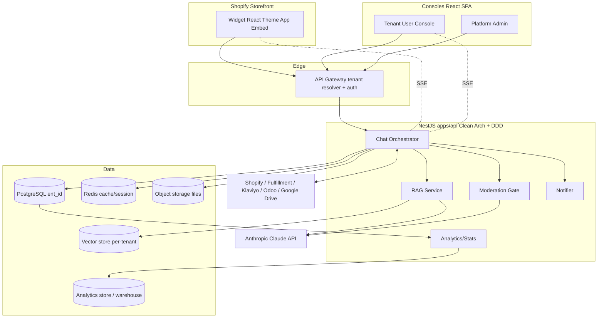
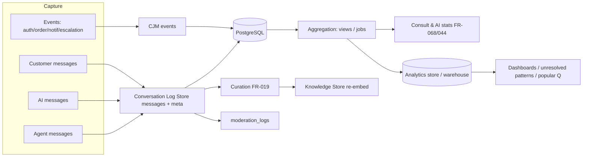

# IVY TalkTalk — Architecture & Tech Stack Report (구현 아키텍처·기술스택 보고서)

본 보고서는 IVY USA TalkTalk(Shopify 위젯형 AI 채팅·상담 SaaS, ivyusa.com 커스텀앱·멀티테넌트 대응) 구현을 위한 **시스템 구조와 기술 스택**을 종합한다. 회사 표준(amoeba code-convention/structure v2)에 정합한다.

## 1. Executive Summary (요약)

- **제품**: Shopify 스토어프론트 임베드 위젯(알림센터+AI 채팅+주문) + 테넌트/시스템 관리자 콘솔.
- **스택(표준)**: React + NestJS + PostgreSQL + Redis + Turbo(모노레포), Clean Architecture+DDD, Claude API(RAG/요약), SSE(실시간), 벡터스토어(RAG).
- **핵심 특성**: 멀티테넌트(`ent_id`), RBAC(직급×라벨)+ACL(소유자 가시성), **발신 응답 모더레이션(상담원·AI 공통, 단어+문맥)**, **전 대화 로깅→분석 파이프라인**, CCPA/GDPR 준수, RAG 지정 지식소스만 참조.

## 2. System Architecture (시스템 아키텍처)



## 3. Technology Stack (기술 스택)

| Layer | Technology | Note |
|-------|-----------|------|
| Frontend | React 18 + TypeScript 5 + TailwindCSS, Vite 5 | Widget(임베드 번들) + Console(SPA), Zustand + React Query, i18n(en/es/ko) |
| Widget delivery | Shopify **Theme App Embed** block | 비동기·경량, 스토어 렌더 영향 0 |
| Backend | **NestJS 10** + TypeScript 5 | Clean Architecture + DDD, 도메인 모듈 |
| API | REST `/api/v1` + **SSE** | 실시간 채팅/스트리밍 |
| Database | **PostgreSQL 15** | OLTP, `ent_id` 멀티테넌시, soft delete, AES-256-GCM |
| Cache/Session | **Redis 7** | 세션·미읽음 카운트·tenant 키 프리픽스 |
| Vector store | per-tenant 네임스페이스(pgvector 또는 외부 벡터DB) | RAG 임베딩·지정 소스 격리 |
| Object storage | S3 호환 | KB 파일/첨부, 암호화 |
| Queue/async | 이벤트 큐(알림 디스패치) | RabbitMQ 또는 동등 |
| AI | **Pluggable multi-engine via AI Provider Gateway** (Anthropic Claude / OpenAI / Google Gemini / Azure / custom) | 어드민에서 엔진 등록·선택(FR-070); RAG 답변·요약·의도/감정·문맥 모더레이션 |
| Analytics | PostgreSQL 집계/머티리얼라이즈드뷰 + (선택) 컬럼형 웨어하우스 | 대화 로그 분석·통계·재학습 |
| Build/Mono | **Turborepo** + tsup/tsc | apps/packages |
| Infra | Nginx, Docker(dev/staging/prod), secrets 분리 | env별 compose/Dockerfile |
| VCS/PM | Git/GitHub ↔ Redmine | WBS/이슈 동기화 |

## 4. Monorepo Structure (모노레포 구조)

```
ivy-talktalk/
├── apps/  api/(NestJS)  web/(React: tenant console + platform admin)  widget/(React embed)
├── packages/  common/  types/  rbac/  ui-kit/
├── docker/  dev|staging|production   env/  docs/  reference/(standards)  scripts/  sql/  secrets/
└── turbo.json  tsconfig.json  CLAUDE.md  SPEC.md  CHANGELOG.md  README.md
```
- **Backend 도메인 모듈**(controller/service/entity/repository/dto): core(auth/users/tenants/rbac/audit), talk(session/scenario/chat/escalation/ai-assist), rag(retrieval/knowledge-source/embedding), orders, notifications, reviews, affiliate, restock-subscription, **agent(profile/assignment/stats)**, **moderation**, admin(analytics/history/customer-product), integrations(shopify/fulfillment/klaviyo/odoo/gdrive), webhooks(shopify/fulfillment/gdpr).
- 레이어 규칙: controller→service→repository/entity, 도메인 격리.

## 5. Data Layer & Model (데이터 계층)

- **PostgreSQL**, DB `db_itt`, 테이블 `itt_`/`itt_talk_`/`itt_kms_` 등; PK UUID `{p}_id`; `ent_id`(테넌트) FK 전면; soft delete; `_visibility`(ACL); AES-256-GCM 암호화(자격증명/PII).
- 주요 도메인 테이블(36+): tenants, admin_users, users, job_labels, roles_permissions, sessions, conversations, **messages(sender_type, moderation)**, orders_cache/order_items/fulfillments, notifications/notification_prefs, reviews, affiliates, restock_subscriptions, subscriptions, kb_*(sources/board/files/documents), campaigns, cjm_events, integration_credentials, audit_logs, **agent_profiles, assignments, content_filter_rules, moderation_logs, agent_daily_stats**.
- DDL: `chat-widget-schema.sql`(표준 정합 PostgreSQL 재발행 예정 — DEVPLAN T-046).

## 6. Conversation Logging & Analytics Pipeline (대화 로깅·분석 파이프라인) — 핵심

**상담원·AI·고객의 모든 대화는 빠짐없이 로깅**되어 분석/재학습 자료로 사용된다(FR-018).



- **저장 단위**: `messages`(session_id, sender_type=customer/agent/ai/system, body, lang, retrieval_trace, moderation decision, created_at) + `conversations`(status, agent, assignment) + `cjm_events`.
- **메타데이터**: 의도/감정(AI-assist), 키워드, 처리시간, 모더레이션 결과, 배정/이관.
- **활용**: ① 상담 통계(FR-068)·AI 처리현황·미해결 패턴·인기 질문(FR-044) ② RAG 재학습 큐레이션(FR-019) ③ 품질/모더레이션 감사.
- **거버넌스**: PII 암호화/마스킹, 보존기간(POL-003), CCPA/GDPR 삭제·비식별(POL-002), 접근 RBAC+ACL(POL-017/019).
- **신뢰성**: 버퍼+재시도, 영속 실패 알림(NFR-007); 상담원 대화는 opt-out 불가(상시 로깅).

## 7. AI / RAG Subsystem (AI·RAG)

- **AI Provider Gateway(FN-053)**: 복수 엔진(Anthropic/OpenAI/Google/Azure/custom) 어댑터 추상화 — System Admin 엔진 카탈로그·키, Master 기능별(chat/RAG/summary/assist/moderation) 엔진 선택(FR-070), 기본값 폴백, 사용량 추적.
- RAG: 테넌트 **지정 활성 Knowledge Source만** 참조(FR-065), 벡터 네임스페이스 격리.
- 지식 소스 3모드: 게시판(파일)/자료실/Google Drive(FR-064) → 파싱·청크·임베딩.
- AI-assist: 대화 요약·의도·감정·추천액션(FR-045). 답변 언어 en/es/ko(FR-027, ES 필수).
- **모더레이션 게이트(FR-069)**: 상담원·AI 발신 전 단어+문맥 필터(Claude classifier) → 통과분만 전달, fail-safe.

## 8. Integrations (외부 연동)

Shopify(REST+Webhook, 주문/고객), Fulfillment(배송 웹훅), Klaviyo(세그먼트/캠페인), Odoo(JSON-RPC, 상품/재고), Google Drive(KB 동기화). 테넌트별 자격증명(암호화, Master 관리). GDPR 필수 웹훅(data_request/redact/shop_redact).

## 9. Security, Privacy & Compliance (보안·프라이버시)

- **AuthN/Z**: JWT 세션토큰(콘솔)·서명 shop(위젯)·HMAC(웹훅); 데코레이터 `@Auth/@AdminOnly/@MasterOrAdmin/@RequireAuth`.
- **RBAC**(직급×라벨, FR-056) + **ACL**(소유자 가시성, POL-019) 중앙 접근 체크 + 감사(audit_logs).
- **Privacy**: CCPA/CPRA + GDPR(+PIPA/PDPD), DSAR·opt-out·삭제, AES-256-GCM·마스킹·bcrypt, 보존/파기 (standards/amoeba_privacy_compliance_v2, POL-002/003/018).
- **Moderation**: 발신 응답 안전 필터(POL-020).
- **Tenant isolation**: `ent_id` 강제·격리 회귀 테스트(NFR-012).

## 10. Multi-Tenancy (멀티테넌시)

테넌트=Shopify 상점. 공유 DB + `ent_id` 행 격리 기본(대형 테넌트 DB 분리 옵션), 벡터/Redis/스토리지 테넌트 네임스페이스. 커스텀앱으로 출발하되 Public app 전환 무중단 설계(CHATWIDGET-MULTITENANCY).

## 11. Deployment & Infra (배포·인프라)

- Docker 환경별(dev/staging/prod), Nginx 리버스프록시, Redis, PostgreSQL, 큐, 벡터스토어.
- SSE 스케일: 스티키/공유 백플레인(Redis pub/sub) 고려. 위젯 정적 자산 CDN.
- CI/CD: Turbo lint/test/build → 환경별 deploy 스크립트; `main`/`develop`/`feature` 브랜치.
- 관측성: 구조화 로그(JSON)+요청ID, 메트릭(요청수/P50·P95/에러율), AI 토큰 사용량(테넌트별).

## 12. Non-Functional Targets (비기능 목표)

RAG < 3s(NFR-001) · 위젯 비차단 로드(NFR-002) · i18n en/es/ko(NFR-003) · CCPA/GDPR(NFR-004) · WebPush PWA(NFR-005) · 주문/배송 정합 웹훅(NFR-006) · 로그 무결성(NFR-007) · 멀티테넌시(NFR-008) · AI 고지(NFR-009) · 상태 표준(NFR-010) · 알림센터 성능(NFR-011) · RBAC/격리(NFR-012) · 모더레이션 신뢰성(NFR-013).

## 13. Risks & Open Issues (리스크·미결)

- 스택 정합: 기존 ERD(MySQL/Next.js 가정) → **PostgreSQL/NestJS 재발행**(DEVPLAN §9, T-046~048).
- 보호 고객 데이터 심사(Shopify), RAG 정확도, 모더레이션 오탐/지연, SSE 스케일, 미결 A-1~A-12.

## 14. Appendix — Document Index (부록: 문서 색인)
요구사항 분석/정의(REQ/REQDEF) · 이벤트 시나리오 · 정책(POLICY) · 기능정의(FUNCDEF) · 시퀀스/DFD/ERD+SQL · 화면정의(UISPEC) · 와이어프레임/프로토타입 · WBS · 수행계획/개발계획(PROJPLAN/DEVPLAN) · RBAC · 멀티테넌시 · 부트스트랩 · 지식소스 · 상담원·모더레이션(AGENTMOD) · 표준(standards/). 전체는 `README.md` 참조.
