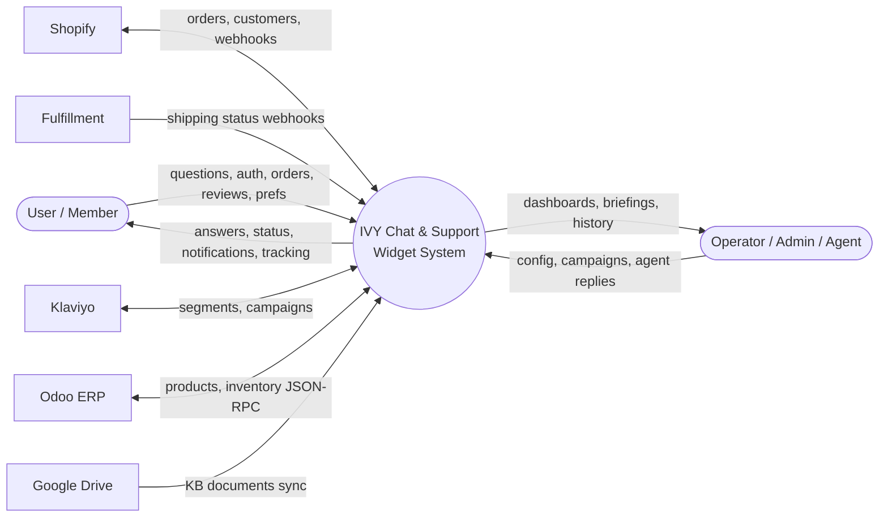
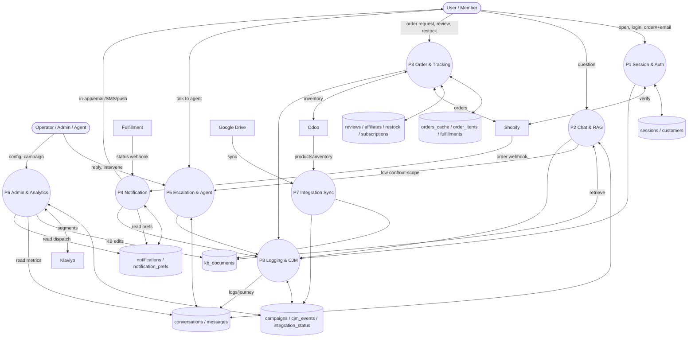

# IVY USA Chat & Support Widget — Data Flow Diagram (데이터플로우 다이어그램)

Data movement among external entities, processes, and data stores. Notation: External entity (사각형), Process (둥근/원), Data store (저장소). Each data store maps to ERD tables (DFD store → TBL).
(외부 엔터티 ↔ 프로세스 ↔ 데이터 저장소 간 데이터 흐름. 각 저장소는 ERD 테이블과 매핑된다.)

---

## DFD Level 0 — Context Diagram (컨텍스트)

---

## DFD Level 1 — Main Processes (주요 프로세스)

---

## Data Store ↔ ERD Mapping (저장소-테이블 매핑)

| DFD Store | ERD Tables |
|-----------|-----------|
| DS1 sessions / customers | `sessions`, `customers` |
| DS2 conversations / messages | `conversations`, `messages`, `inquiries` |
| DS3 orders | `orders_cache`, `order_items`, `fulfillments` |
| DS4 notifications | `notifications`, `notification_prefs` |
| DS5 feature records | `reviews`, `affiliates`, `restock_subscriptions`, `subscriptions` |
| DS6 knowledge | `kb_documents` |
| DS7 ops/meta | `campaigns`, `cjm_events`, `integration_status`, `agents` |

## Key Data Flows (주요 흐름 요약)
- **Inbound transactional**: Shopify/Fulfillment webhooks → P4 → notifications store → user (in-app + opted-in channels).
- **Inbound knowledge**: Google Drive + operator KB → P7/P6 → kb_documents → P2 RAG retrieval.
- **Inbound marketing**: Klaviyo segments → P6 campaign → P4 dispatch (opt-out filtered).
- **Cross-cutting**: every process emits to P8 (logging + CJM) for analytics (P6) and re-training.
- **Auth boundary**: P1 binds scope; P3 personal-data flows require it (POL-001).
