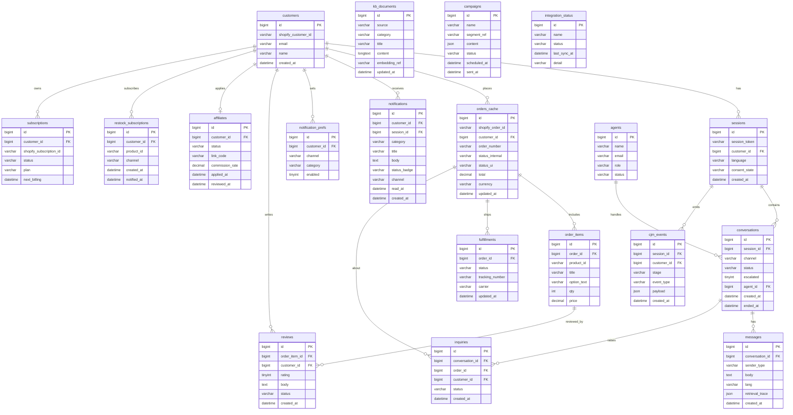

# IVY USA Chat & Support Widget — ERD (엔터티 관계도)

Database schema (MySQL). DDL is generated separately as `chat-widget-schema.sql`. All identifiers in English; timestamps `created_at`/`updated_at` standard.
(MySQL 스키마. DDL은 별도 SQL 파일로 생성한다.)

---

## ER Diagram (관계도)

---

## Table Definitions (테이블 정의 — 요약)

| Table | Purpose | Key FKs | FN/FR |
|-------|---------|---------|-------|
| customers | Customer identity cache | shopify_customer_id | FN-014, FR-007 |
| sessions | Visitor sessions, language, consent | customer_id | FN-006, FR-001/002 |
| conversations | Chat conversations, status, escalation | session_id, agent_id | FN-035, FR-017 |
| messages | Conversation turns + retrieval trace | conversation_id | FN-046, FR-018 |
| orders_cache | Non-authoritative order mirror | customer_id | FN-019, FR-010 |
| order_items | Order line items + options | order_id | FN-023, FR-032 |
| fulfillments | Shipping status + tracking | order_id | FN-020, FR-011/043 |
| notifications | Notification inbox records | customer_id, session_id | FN-003/025, FR-029 |
| notification_prefs | Per-channel/category opt-in | customer_id | FN-004, FR-049 |
| reviews | Product reviews | order_item_id, customer_id | FN-029, FR-034 |
| affiliates | Affiliate applications + link | customer_id | FN-030, FR-035 |
| restock_subscriptions | Back-in-stock subscriptions | customer_id | FN-032, FR-036 |
| subscriptions | Product subscriptions | customer_id | FN-033, FR-037 |
| inquiries | My-inquiries records | conversation_id, order_id | FN-024, FR-033 |
| kb_documents | Knowledge base (KS + GDrive) | - | FN-016/045, FR-020/021 |
| campaigns | Marketing/event campaigns | - | FN-042, FR-040 |
| cjm_events | Customer journey events | session_id, customer_id | FN-047, FR-026 |
| agents | Live agents | - | FN-035, FR-017 |
| integration_status | Integration health | - | FN-038, FR-041/042/043 |

## Tenancy & RBAC Tables (테넌시·권한 — CHATWIDGET-RBAC)

Multi-tenant & access-control extension. **All tenant data tables add `tenant_id`** (sessions, conversations, messages, orders_cache, notifications, reviews, affiliates, subscriptions, kb_documents, campaigns, cjm_events, inquiries, restock_subscriptions, notification_prefs).

| Table | Purpose | Key columns | FR |
|-------|---------|-------------|----|
| tenants | Tenant (shop) master | id, shop_domain, status, plan | FR-051,052 |
| admin_users | System admins | id, email, level(super_admin/admin), status | FR-053,059 |
| users | Tenant staff | id, tenant_id, email, rank(master/director/manager/staff), status | FR-054 |
| job_labels | Editable job labels per tenant | id, tenant_id, code, name | FR-055 |
| user_job_labels | User↔label N:M | user_id, job_label_id | FR-055 |
| roles_permissions | rank×label capability grants | id, scope, rank, label, capability, allow | FR-056 |
| integration_credentials | Per-tenant external creds (encrypted) | id, tenant_id, provider, secret_enc, status | FR-060 |
| audit_logs | Privileged-action audit | id, tenant_id, actor_type, actor_id, action, target, created_at | FR-061 |
| customers (changed) | + tenant_id, tier, shopify_tier | tier(guest/subscriber/regular), shopify_tier | FR-057 |

DDL appended in `chat-widget-schema.sql` (Tenancy & RBAC section).

## Bootstrap, Auth & Knowledge Source Tables (부트스트랩·인증·지식소스 — FR-062~065)

| Table | Purpose | Key columns | FR |
|-------|---------|-------------|----|
| invitations | User invite + temp password | tenant_id, email, rank, token, temp_password_hash, status, expires_at | FR-063 |
| admin_users / users (changed) | + password_hash, must_change_password (+users.invited_at) | auth/onboarding | FR-062,063 |
| knowledge_sources | KB source master (3 modes) | tenant_id, type(board/repository/gdrive), status, designated, config_json | FR-064 |
| kb_board_posts | Board posts (M1) | tenant_id, source_id, title, body, author_user_id | FR-064 |
| kb_files | Attachments / repository files (M1/M2) | tenant_id, source_id, post_id, filename, storage_path | FR-064 |
| kb_documents (changed) | + tenant_id, source_id, active, status | RAG chunks scoped to source | FR-065 |

Seed (FR-062): tenant `ivyusa`, admin `admin@amoeba.group`, master `dev@amoeba.group` (bcrypt hashes; must_change_password=1). See `chat-widget-schema.sql` Seed section & CHATWIDGET-BOOTSTRAP.

## Migration Notes (마이그레이션)
- `orders_cache`/`fulfillments` are caches synced via webhook (NFR-006); source of truth = Shopify/Odoo.
- `status_internal`↔`status_ui` mapping enforced at app layer per POL-014.
- `kb_documents.embedding_ref` points to the vector index entry (RAG); re-embed on edit (FN-040).
- Retention/anonymization jobs operate on `messages`, `cjm_events`, `notifications` per POL-003 (period [TBD]).
- DDL: see `chat-widget-schema.sql`.
