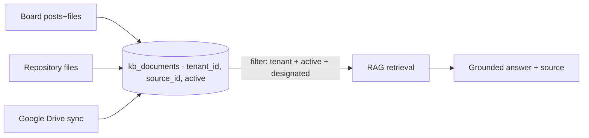

# IVY TalkTalk — Knowledge Source Management (RAG 지식 소스 관리)

Master 설정 메뉴에 **RAG 지식 소스 업로드·내용 관리** 기능을 추가한다. 3가지 모드를 지원하고, **AI는 지정된 Knowledge Source만 참조**한다.

## 1. Modes (3가지 소스 모드 — FR-064)

| Mode | 이름 | 설명 | 입력 |
|------|------|------|------|
| M1 | 게시판 (Board) | 글 작성 + **파일 업로드 첨부**; 글/첨부가 지식화 | title, body, attachments |
| M2 | 자료실 (File Repository) | **파일 직접 업로드**(PDF/DOCX/TXT 등) | files |
| M3 | 구글드라이브 (Google Drive) | 폴더 **연동·동기화**(보조) | drive folder |

- 각 소스는 **활성/비활성(active/inactive)** 토글. Master가 생성·관리(FR-060).
- 업로드/동기화 시 파싱 → 청크 → **재임베딩**(상태 표시). 내용 수정/삭제 시 재임베딩.

## 2. AI Source Scoping (AI 참조 범위 — FR-065)

- RAG 검색은 **`tenant_id` + 활성 + "봇에 지정(designated)"된 Knowledge Source** 로만 한정. 미지정/비활성 소스, 타 테넌트, 외부 임의 출처는 참조 금지.
- 우선순위(POL-013): Knowledge Store(게시판/자료실) 우선 → Google Drive 보조.
- 답변에 출처 카테고리/소스 표기(FR-013).

## 3. Functional Requirements (요구사항)

| ID | Requirement | Priority |
|----|-------------|----------|
| FR-064 | Knowledge Source management (Master): 3 modes — 게시판(파일 업로드 포함) / 자료실(파일 업로드) / Google Drive 연동 — 생성·업로드·**내용 관리(수정/삭제)**·활성화 | P0 |
| FR-065 | AI knowledge scoping — RAG는 **지정된 활성 Knowledge Source만** 참조(테넌트 격리, 미지정/외부 출처 차단); 답변에 소스 표기 | P0 |

## 4. ERD Tables (데이터 모델)

| Table | Purpose | Key columns |
|-------|---------|-------------|
| `knowledge_sources` | 소스 마스터 | id, tenant_id, type(board/repository/gdrive), name, status(active/inactive), designated(bool), config_json |
| `kb_board_posts` | 게시판 글 | id, tenant_id, source_id, title, body, author_user_id, created_at |
| `kb_files` | 첨부/자료 파일 | id, tenant_id, source_id, post_id(nullable), filename, mime, storage_path, size |
| `kb_documents`(변경) | 임베딩 청크 | + source_id, active, status(embedded/pending) |

- Google Drive 모드는 `knowledge_sources.config_json`에 폴더/동기화 설정 저장(FN-045 동기화).

## 5. UI (Master 설정 → 지식 소스)

- 소스 목록(타입·상태·지정 여부·문서수·최근 동기화) + "소스 추가".
- **게시판**: 글 목록/작성(에디터+파일 첨부), 글 편집/삭제.
- **자료실**: 드래그업로드, 파일 목록(상태: 임베딩완료/대기), 삭제.
- **구글드라이브**: 폴더 연결, 동기화 주기/지금 동기화, 상태.
- 소스별 **AI 참조 지정(designated)** 토글 + 활성/비활성.
- 화면: SCR-105(AI Setting) 하위 "Knowledge Source" 탭(SCR-105K).

## 6. Policy update (정책)
- **POL-011 R3 보강**: AI는 **지정된 활성 Knowledge Source만** 참조. 미지정/비활성/외부 출처·타 테넌트 참조 금지(NFR-012). 우선순위는 POL-013.

## 7. FN impact
- **FN-040(AI Setting)**: Knowledge Source CRUD(3 modes)·지정·재임베딩 포함.
- **FN-016(RAG retrieval)**: 검색 필터에 `source.active && source.designated && tenant_id` 추가.
- **FN-045(GDrive sync)**: M3 소스에 연결.

**Related**: FR-064, FR-065, FR-060, FR-013, FR-020~022 · POL-011, POL-013, NFR-012 · SCR-105.
