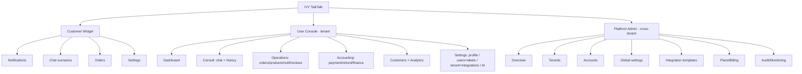

# IVY TalkTalk — Menu Structure & File System (메뉴 구조·파일 시스템)

3개 액터 그룹(Customer / Tenant User / System Admin)별 메뉴 구조와, 구현 파일 시스템(모노레포) 및 라우팅 매핑을 정리한다. 가시성은 RBAC(rank × label, CHATWIDGET-RBAC)로 결정.

---

## 1. Customer Group — Storefront Widget (고객 · 위젯 메뉴)

스토어프론트 임베드 위젯. 메뉴 = 상단 탭 + 채팅 시나리오. 로그인 상태별 분기(FR-058).

```
알림센터 (Notification Center)
├─ Notifications (탭)
│   └─ 필터: 전체 · 결제 · 배송 · 이벤트 · 리뷰
│       └─ 항목 → 주문상세 / 배송추적 / 리뷰쓰기 / 이벤트
├─ Chat (탭)  · AI 고지 상시
│   └─ 시나리오 메뉴
│       ├─ 배송 상태            → (인증) 주문 선택
│       ├─ 취소 / 환불          → (인증) 정책 안내
│       ├─ Product Help        → 사용법 · 성분 · 교환/반품 · 재입고 알림 · 처음으로
│       ├─ Contact Support     → 전화 · 이메일 · 채팅 상담 연결
│       ├─ Affiliate           → 신청 · 더 알아보기
│       └─ My Orders           → (인증) 최근 주문
├─ Orders (탭)  · (로그인/인증 필요)
│   └─ 결제내역 · 배송현황 · 문의하기
└─ ⚙ 설정 → 알림 설정(채널·카테고리), CCPA opt-out
```
- **Logged-out (Guest/Subscriber)**: 비개인 FAQ·상품문의, 게스트 주문조회, 비개인 알림, 구독쿠폰(구독회원).
- **Logged-in (Regular/Shopify tier)**: 전체 개인 기능 + 개인화 헤더.

---

## 2. Tenant User Group — User Console (유저 · 콘솔 메뉴)

테넌트 직원용 콘솔. 좌측 내비. **가시성 = 직급(rank) × 직무 라벨(label)** — 권한 없는 메뉴는 비표시(deny-by-default, FR-056).

```
IVY TalkTalk · User Console (tenant)
├─ Dashboard (대시보드)                         [전 직급, 지표 범위 차등]
├─ 상담 (Consult 라벨)
│   ├─ 실시간 채팅 (Inbox/Console + AI 브리핑)   [상담]
│   └─ 상담 이력                                 [상담]
├─ 운영 (Operations 라벨)
│   ├─ 주문 / 배송                               [운영]
│   ├─ 상품 / 재고                               [운영]
│   ├─ 알림 / 캠페인                             [운영, 발송=Manager+]
│   └─ 리뷰                                      [운영]
├─ 회계 (Accounting 라벨)
│   ├─ 결제 / 환불                               [회계]
│   └─ 재무 리포트                               [회계]
├─ 고객 관리                                     [Manager+ / 라벨 연관]
├─ 분석 / 리포트                                 [Manager+]
└─ ⚙ 설정 (Settings)
    ├─ 내 프로필 / 알림                          [전 직급]
    ├─ 유저 · 라벨 관리 (SCR-207)                [Master / Director(하위·라벨부여)]
    ├─ 테넌트 설정 · 외부연동 (SCR-207A)          [Master 전용]
    └─ AI 설정 (Bot·Rules·Knowledge·시나리오)     [Master / Director]
        └─ 지식 소스 (Knowledge Source, SCR-105K)  [Master]
            ├─ 게시판 (글+파일 업로드)
            ├─ 자료실 (파일 업로드)
            └─ 구글드라이브 연동
            · 소스별 활성/비활성 · AI 참조 지정(designated) · 재임베딩
```

### 2.1 Menu Visibility by Rank (직급별 메뉴 가시성)

| Menu | Master | Director | Manager | Staff |
|------|:------:|:-------:|:-------:|:-----:|
| Dashboard | ✅ | ✅ | ✅ | ⚠️ 본인 |
| 실시간 채팅 / 이력 (상담) | ✅ | ✅ | ✅ | ✅ 배정분 |
| 주문·배송 / 상품·재고 / 리뷰 (운영) | ✅ | ✅ | ✅ | ✅ 라벨 |
| 알림·캠페인 (발송) | ✅ | ✅ | ✅ | ❌ |
| 결제·환불 / 재무 (회계) | ✅ | ✅ | ✅ | ✅ 라벨 |
| 고객 관리 / 분석 | ✅ | ✅ | ✅ | ❌ |
| 설정 · 유저/라벨 관리 | ✅ | ⚠️ 하위·라벨부여 | ❌ | ❌ |
| 설정 · 테넌트/외부연동 | ✅ | ❌ | ❌ | ❌ |
| 설정 · AI 설정 | ✅ | ✅ | ⚠️ | ❌ |

> 최종 표시 = 직급 가시성 ∩ 보유 라벨. 예) Staff+상담 → 실시간 채팅/이력만; Staff+회계 → 결제/환불만.

---

## 3. System Admin Group — Platform Console (시스템 어드민 · 플랫폼 메뉴)

플랫폼(크로스 테넌트) 콘솔. Super Admin / Admin.

```
IVY TalkTalk · Platform Admin
├─ Overview (플랫폼 모니터링)                    [Super/Admin]
├─ 테넌트 관리 (SCR-201)                         [Super=승인·오프보딩 / Admin=검토·승인]
├─ 계정 관리 (SCR-202)                           [Super=어드민계정 / Admin=테넌트유저 지원]
├─ 글로벌 설정 (SCR-203)                          [Super=write / Admin=read]
├─ AI 엔진 관리 (SCR-203A)                        [Super=키/기본 / Admin=조회·활성] — 복수 엔진 등록·선택(FR-070)
├─ 외부연동 템플릿 (SCR-204)                      [Super/Admin]
├─ 플랜 · 과금 (SCR-205)                          [Super only]
└─ 감사 · 모니터링 (SCR-206)                      [Super=full / Admin=read]
```

---

## 4. Menu Map (메뉴 구조도)



---

## 5. Implementation File System (구현 파일 시스템 · 모노레포)

```
ivy-talktalk/
├─ apps/
│  ├─ widget/                 # Customer storefront widget (React, Theme App Embed bundle)
│  │  ├─ src/
│  │  │  ├─ NotificationCenter/  # tabs, inbox, filters (FN-002,003)
│  │  │  ├─ chat/               # welcome, scenarios, product-help, support, affiliate (FN-008~010,015~018)
│  │  │  ├─ orders/             # panel, detail, tracking (FN-019~024)
│  │  │  ├─ review/             # review writing (FN-029)
│  │  │  ├─ settings/           # notification prefs (FN-004)
│  │  │  ├─ auth/               # auth gate (FN-011~014)
│  │  │  └─ lib/ (api client, tenant/shop resolver, i18n)
│  │  └─ embed/                 # loader.js (async), App Embed liquid block
│  ├─ admin/                  # React SPA — both consoles, route-guarded by RBAC
│  │  ├─ src/
│  │  │  ├─ platform/           # System Admin (SCR-201~206)
│  │  │  │  ├─ tenants/ accounts/ globalSettings/ integrations/ billing/ audit/
│  │  │  ├─ tenant/             # User Console
│  │  │  │  ├─ dashboard/ liveChat/ history/ orders/ products/ notifications/
│  │  │  │  ├─ reviews/ accounting/ customers/ analytics/
│  │  │  │  └─ settings/ (profile/ users-labels(SCR-207)/ tenant-integrations(SCR-207A)/ ai-setting(SCR-105))
│  │  │  ├─ auth/ (session token, App Bridge)
│  │  │  ├─ rbac/ (guards, permission resolver: rank ∩ label)
│  │  │  └─ shared-ui/
│  └─ api/                    # Next.js backend (Chat Orchestrator)
│     ├─ src/
│     │  ├─ modules/
│     │  │  ├─ session/ auth/ scenario/ rag/ orders/ notifications/
│     │  │  ├─ reviews/ affiliate/ restock-subscription/ escalation/ ai-assist/
│     │  │  ├─ admin-analytics/ conversation-history/ ai-setting/ customer-product/
│     │  │  ├─ knowledge-source/ (board/ repository/ gdrive; upload, content mgmt, embed; FR-064,065)
│     │  │  ├─ invitation/ (temp password, forced change; FR-063)
│     │  │  ├─ tenancy/ (tenant resolver, provisioning, offboarding)
│     │  │  ├─ rbac/ (roles_permissions, policy enforcement, audit)
│     │  │  └─ integrations/ (shopify/ fulfillment/ klaviyo/ odoo/ gdrive/)
│     │  ├─ webhooks/ (shopify, fulfillment, gdpr: data_request/redact/shop_redact)
│     │  ├─ queue/ (RabbitMQ producers/consumers)
│     │  ├─ cache/ (Redis, tenant-prefixed)
│     │  └─ middleware/ (tenant scope, hmac, rate-limit, audit)
├─ packages/
│  ├─ shared/ (types, FR/FN ids, status mapping POL-014, i18n EN/ES/KO)
│  ├─ rbac/ (permission matrix definition, shared guard logic)
│  └─ ui-kit/ (design tokens, components)
├─ db/
│  ├─ chat-widget-schema.sql
│  └─ migrations/
├─ infra/ (nginx, redis, rabbitmq, docker-compose, ci-cd)
├─ docs/ (analysis/ design/ implementation/ test/ — SDLC artifacts)
└─ .github/ (ISSUE_TEMPLATE/, workflows)
```

- **Tenancy**: 모든 데이터 접근은 `middleware/tenant-scope` 통과(tenant_id 강제). 위젯=서명 shop, 콘솔=세션토큰 dest, 웹훅=HMAC+shop.
- **RBAC**: `packages/rbac` 공유 매트릭스 → admin 라우트 가드 + api 미들웨어 양쪽 적용(deny-by-default).
- **배포**: widget은 Theme App Embed 번들(경량·비동기), admin은 임베디드 SPA(App Bridge), api는 Next.js 서비스.

---

## 6. Route ↔ SCR ↔ FN Map (라우팅 매핑)

| Surface | Route | SCR | FN |
|---------|-------|-----|----|
| Widget | (embed) | SCR-001~013 | FN-001~033 |
| User Console | /dashboard | SCR-101 | FN-038 |
| User Console | /live-chat | SCR-102 | FN-035,037 |
| User Console | /history | SCR-104 | FN-039 |
| User Console | /orders /products | SCR-106 | FN-041 |
| User Console | /notifications /events | SCR-103 | FN-042 |
| User Console | /settings/users | SCR-207 | FN(RBAC) |
| User Console | /settings/tenant | SCR-207A | FN-040,060 |
| User Console | /settings/ai | SCR-105 | FN-040 |
| Platform Admin | /admin/tenants | SCR-201 | tenancy |
| Platform Admin | /admin/accounts | SCR-202 | rbac |
| Platform Admin | /admin/settings | SCR-203 | — |
| Platform Admin | /admin/integrations | SCR-204 | integrations |
| Platform Admin | /admin/billing | SCR-205 | billing |
| Platform Admin | /admin/audit | SCR-206 | audit |

Traceability: Menu → Route → SCR → FN → FR. Visibility gated by RBAC (FR-056, POL-017).
