# IVY USA Chat & Support Widget — Project Execution Plan (프로젝트 수행계획서)

## 1. Project Overview (프로젝트 개요)

- **Project (프로젝트)**: IVY USA Chat & Customer Support Widget
- **Client (발주사)**: IVY USA — https://www.ivyusa.com (Shopify)
- **Vendor (수행사)**: Amoeba (KR–VN distributed team)
- **Baseline (기준)**: Naver Shopping "Naver TalkTalk" feature set
- **Duration (기간)**: ~14 weeks (M1–M4), target start per kickoff
- **Background (배경)**: Port a Naver TalkTalk–equivalent experience onto Shopify — order/notification, guest product inquiry, scenario + RAG AI answering, human-agent escalation, conversation logging for re-training, with an admin console and CRM/CJM.

## 2. Objectives & Success Metrics (목표·성공 지표)

| KPI | Measurement | Target |
|-----|-------------|--------|
| AI 자동 해결률 | AI-resolved / total conversations | ≥ 70% |
| RAG 응답 지연 | typical query latency | < 3s (NFR-001) |
| 위젯 로드 영향 | storefront render block | 0 (async, NFR-002) |
| 상담원 인계율 | escalations / total | monitored (baseline) |
| 알림 발송 성공률 | delivered / dispatched | ≥ 98% |
| 미해결 패턴 | Top-N tracked for KB curation | declining trend |

## 3. Scope (범위)

- **In-Scope**: Widget (EN/ES/KO) on Shopify; Notification Center (alerts/chat/orders); Auth Gate (account/social/guest lookup); order status/tracking/cancel-refund; guest product inquiry + RAG; reviews; affiliate; restock/subscription; multi-channel notifications; agent console + AI assist; admin dashboard/analytics/AI settings/customer-product mgmt; integrations (Shopify, Fulfillment, Klaviyo, Odoo, Google Drive); CRM/CJM; CCPA baseline.
- **Out-of-Scope (Phase 2)**: Automated re-training pipeline; scenario auto-refinement; native mobile app; multilingual RAG knowledge base.
- **MVP (M2)**: FR-001~003, 005~033, 043, 049, 050 core + notifications + agent console + CCPA + i18n.
- **Full (M3)**: reviews, affiliate, restock/subscription, campaigns, AI-assist, admin dashboard/history/settings, customer/product mgmt.

Deliverables index: see `README.md` (산출물 인덱스).

## 4. Methodology (수행 방법론)

5-stage SDLC per `chat-widget-sdlc-process.md`: Analysis → Definition → (Event Scenario → Policy → Functional → Sequence/DFD/ERD → UI Spec → Wireframe → Prototype) → Implementation → Test. Phase gates G1–G6 must pass before progressing. GitHub-native execution with Redmine PM sync; single ID system (FR→FN→SCR→TBL→T→TC).

## 5. Organization & RACI (조직·역할)

| Role | Member | Responsibility |
|------|--------|----------------|
| Project Owner | IVY USA | Requirement/content approval, sign-off |
| PM | PM-Lisa | Plan, schedule, risk, client comms, configuration mgmt |
| Backend Lead | BE-Kim | Orchestrator, auth, Shopify/Fulfillment, DB, logging |
| Backend | BE-Tran | RAG, notifier, Klaviyo/Odoo, AI-assist, performance |
| Frontend Lead | FE-Lee | Widget core, chat, agent console, AI settings |
| Frontend | FE-Vu | Notifications, orders, dashboard, customer/product |
| QA | QA-Park | Test cases, unit/integration, release gate |
| Live Agents | IVY USA support | Escalation handling (operational) |

**RACI (key activities)**

| Activity | PM | BE | FE | QA | Client |
|----------|----|----|----|----|--------|
| Requirements sign-off | A | C | C | I | R |
| Design docs | A | R | R | C | I |
| Implementation | A | R | R | C | I |
| Testing & release | A | C | C | R | I |
| Open-issue decisions ([TBD]) | R | C | C | I | A |

(R=Responsible, A=Accountable, C=Consulted, I=Informed)

## 6. Schedule & Milestones (일정·마일스톤)

| Milestone | Weeks | Completion Criteria | Tasks |
|-----------|-------|---------------------|-------|
| M1 Foundation | W1–4 | Environments, integrations, DB/ERD, orchestrator, auth, RAG, logging | T-001~013 |
| M2 MVP Widget | W5–8 | Notification Center, chat/RAG, auth, orders/tracking, order flow, notifier, order notifications, agent console, CCPA, i18n | T-014~023, 029, 036, 037 |
| M3 Full Features | W9–12 | Reviews, affiliate, restock/subscription, campaign, AI-assist, admin dashboard/history/settings, customer/product mgmt | T-024~028, 030~035 |
| M4 QA & Release | W13–14 | Unit + E2E + performance passed; critical/major bugs = 0 | T-038~040 |

```mermaid
gantt
    title IVY Chat Widget — Schedule (14 weeks)
    dateFormat  X
    axisFormat  W%s
    section M1 Foundation
    Env & Integrations (T-001~007)   :0, 2
    Backend Foundation (T-008~013)   :2, 2
    section M2 MVP Widget
    Widget core & flows (T-014~021)  :4, 3
    Notifier & order notif (T-022~023):5, 2
    Agent console / CCPA / i18n       :6, 2
    section M3 Full Features
    Reviews/Affiliate/Restock         :8, 2
    Campaign / AI-assist              :9, 2
    Admin dash/history/settings       :10, 2
    section M4 QA & Release
    Unit + E2E + Performance          :12, 2
```

## 7. Resource & Effort Plan (자원·공수 계획)

Total development effort: **151 man-days** (excl. PM oversight, which is continuous).

| Role | Member | Effort (MD) |
|------|--------|-------------|
| Backend | BE-Tran | 40 |
| Frontend Lead | FE-Lee | 38 |
| Backend Lead | BE-Kim | 30 |
| Frontend | FE-Vu | 30 |
| QA | QA-Park | 11 |
| PM (task setup) | PM-Lisa | 2 |
| **Total** | | **151** |

| Phase | Effort (MD) |
|-------|-------------|
| P0 Environment & Integrations | 18 |
| P1 Backend Foundation | 25 |
| P2 Customer Widget | 28 |
| P3 Notifications & Flows | 26 |
| P4 Escalation & Admin | 32 |
| P5 Cross-cutting & QA | 22 |

Critical path: T-001→T-002→T-008→T-009→T-011→T-017→T-019→T-038→T-039 (auth T-011 and RAG T-012 are highest fan-in — protect first).

## 8. Technical Architecture (기술 아키텍처)

- **Frontend**: React (customer widget + admin SPA), Zustand, React Router (admin).
- **Backend**: Next.js (Chat Orchestrator), RabbitMQ (async), Redis (session/cache), MySQL (19 tables).
- **AI**: RAG service over Knowledge Store (primary) + Google Drive (secondary); escalation to agent console; AI-assist briefing.
- **Integrations**: Shopify (REST+Webhook), Fulfillment (Webhook), Klaviyo (segments/campaigns), Odoo (JSON-RPC), Google Drive (KB sync), AmoebaTalk [TBD].
- **Notifications**: in-app (always on) + Email/SMS/Web Push (PWA Service Worker).
- Details: `chat-widget-sequence.md`, `chat-widget-dfd.md`, `chat-widget-erd.md`.

## 9. Environment & Configuration Management (환경·형상관리)

- **Environments**: Dev / Staging / Production (Nginx reverse proxy, Redis).
- **Branching**: `main` (prod), `develop` (integration), `feature/{issue}-{desc}` per task.
- **VCS/PM**: Git/GitHub (code), Redmine (PM) — bidirectional sync; commit convention `docs|feat|fix({stage}): ...`.
- **CI/CD**: build/test on PR; protected `main` with review required.
- **Docs**: versioned (semver) under `docs/`; SQL under `sql/`.

## 10. Quality & Test Strategy (품질·테스트 전략)

- **Unit (Stage 4)**: TC per FN/FR; pass criteria ≥ 95% pass, 0 critical bugs.
- **Integration/E2E (Stage 5)**: scenario-based ITC over S1–S17; regression on existing flows; performance vs NFR-001/002/011.
- **Gates**: G1–G6 (process standard §7) enforced per stage.
- **Bug tracking**: GitHub Bug Issues with severity labels; release blocks on critical/major.
- **Accessibility/i18n**: tap targets ≥44px, color-independent status, EN/ES/KO coverage.

## 11. Risk Management (리스크 관리)

| Risk | Impact | Likelihood | Mitigation |
|------|--------|-----------|------------|
| RAG accuracy/scope gaps | High | Med | Confidence threshold + agent escalation; KB curation loop |
| Open issues unresolved ([TBD]) | High | Med | Decision deadline before M2/M3 gates; PM-driven (RACI A=Client) |
| Integration instability (Shopify/Fulfillment/Klaviyo/Odoo) | High | Med | Retry/backoff (NFR-006); health monitoring; sandbox first |
| Web Push depends on PWA timeline | Med | Med | Fallback to in-app + email; sequence after PWA |
| KR–VN timezone/comms | Med | Med | Async-first, daily standup overlap window, written specs |
| Scope creep from screens | Med | Med | Change control vs README index; phase gating |
| CCPA/retention legal delay | Med | Low | Engage client legal early (A-6) |

## 12. Communication Plan (커뮤니케이션)

| Channel | Cadence | Audience |
|---------|---------|----------|
| Daily standup | Daily (overlap window) | Dev team (KR–VN) |
| Weekly status report | Weekly | PM ↔ Client |
| Milestone review/demo | End of M1–M4 | Client + team |
| Code review | Per PR | Dev team |
| Issue/board updates | Continuous | GitHub Projects + Redmine |
| Decision log ([TBD]) | As needed | PM + Client |

## 13. Assumptions, Constraints & Open Issues (가정·제약·미결)

- **Assumptions**: Shopify APIs/webhooks available; client provides FAQ/policy content and KB; KR–VN team availability per plan.
- **Constraints**: EN-base RAG knowledge in phase 1; Web Push via PWA only (no native app); CCPA baseline.
- **Open issues**: A-1 RAG language, A-2 AmoebaTalk depth, A-6 retention, A-7 Odoo scope, A-8 Klaviyo/Notifier split, A-9 review trigger/storage, A-10 affiliate settlement, A-11 customer/product read-vs-write, plus refund window / warranty terms / rate limits. Owners and deadlines tracked in the decision log; must close before the affected milestone gate.

## 14. Approval (승인)

| Role | Name | Date | Signature |
|------|------|------|-----------|
| Project Owner (IVY USA) | | | |
| PM (Amoeba) | | | |
| Tech Lead (Amoeba) | | | |
