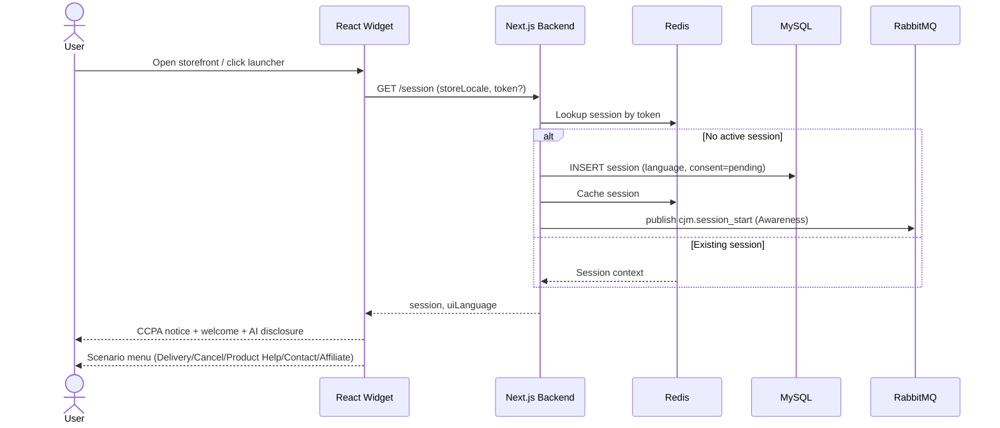
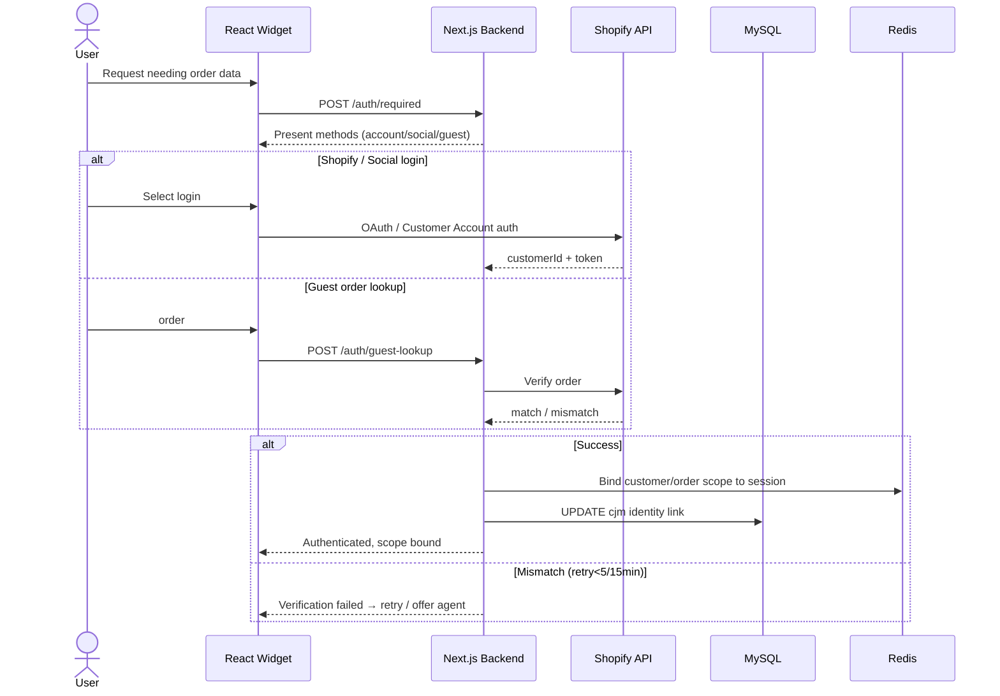
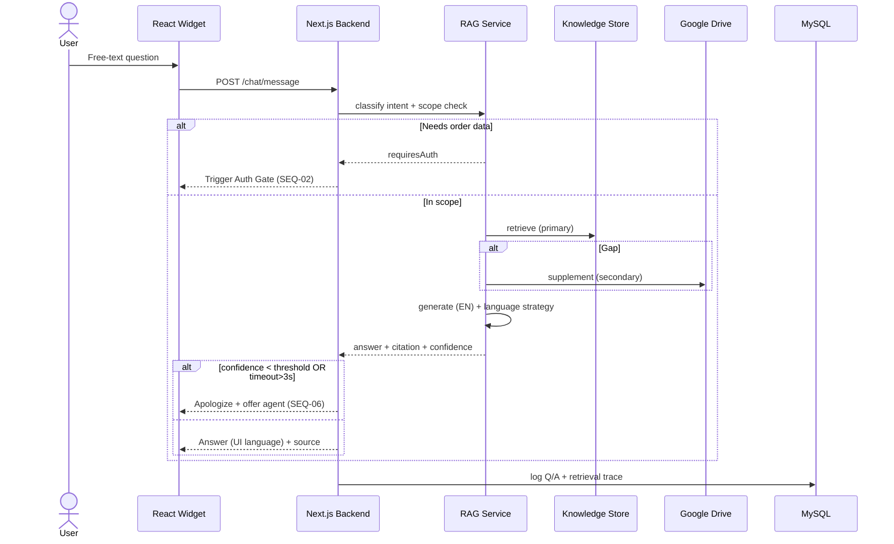
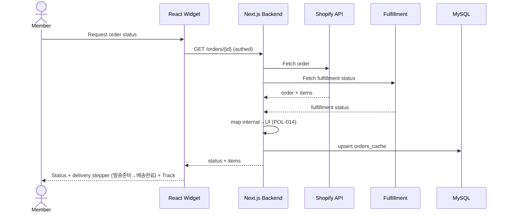
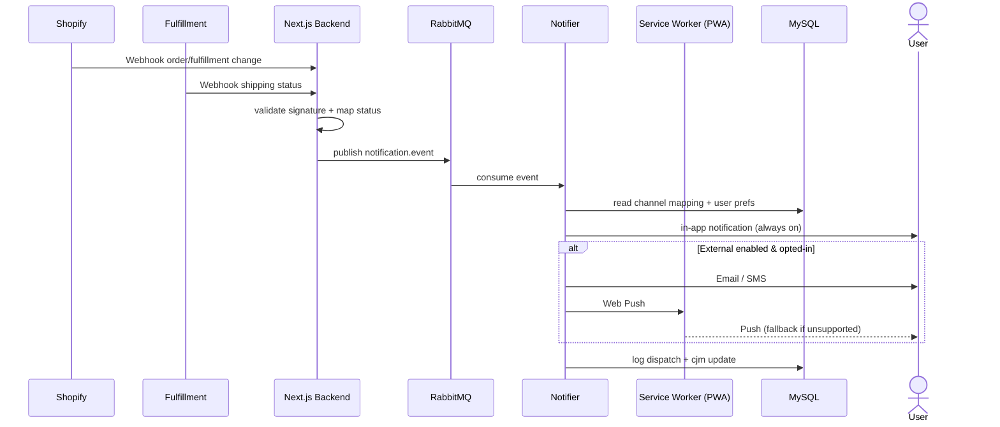
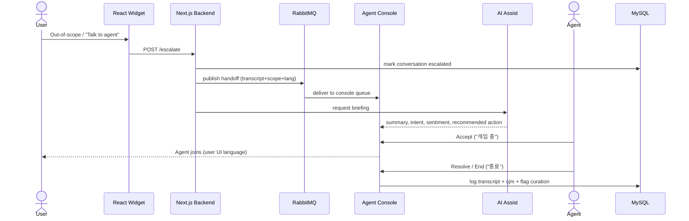
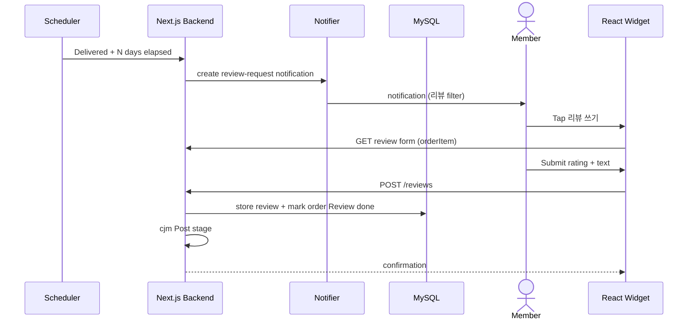
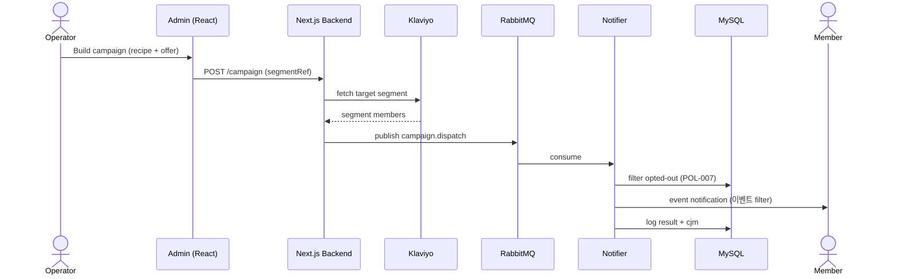

# IVY USA Chat & Support Widget — Sequence Diagrams (시퀀스 다이어그램)

Technical flows for key functions. Participants use the real stack: **React Widget**, **Next.js Backend** (Chat Orchestrator), **MySQL**, **RabbitMQ**, **Redis**, and external services (Shopify, Fulfillment, Klaviyo, Odoo, Google Drive). Each diagram references FN/FR and the event scenario (S-NN).
(핵심 기능의 기술 흐름. participant는 실제 스택을 사용한다.)

---

## SEQ-01: First Access, Welcome & Session (S1 — FN-001, FN-006~008)



---

## SEQ-02: Auth Gate (S4 — FN-011~014)



---

## SEQ-03: Natural-Language RAG Answering (S5 — FN-015~018)



---

## SEQ-04: Order Status & Delivery Tracking (S6, S11 — FN-019, FN-020)



---

## SEQ-05: Notification Dispatch via Webhook (S8 — FN-025~027)



---

## SEQ-06: Escalation & Agent Console with AI Assist (S7, S17 — FN-034, FN-035, FN-037)



---

## SEQ-07: Review Request & Writing (S13 — FN-028, FN-029)



---

## SEQ-08: Affiliate Application (S12 — FN-030, FN-031)

```mermaid
sequenceDiagram
    actor User
    participant W as React Widget
    participant BE as Next.js Backend
    participant DB as MySQL
    actor Operator
    participant ML as Email

    User->>W: "How to become an Affiliate?"
    W-->>User: Program info + CTAs
    User->>W: 지금 신청하기 (form)
    W->>BE: POST /affiliate/apply
    BE->>DB: store application (status=pending)
    BE->>MQ: cjm event
    Operator->>BE: Review (approve/reject)
    BE->>DB: update status; generate link if approved
    BE->>ML: send result email (1–3 business days)
```

---

## SEQ-09: Event/Coupon Campaign Dispatch (S16 — FN-042)



---

## Notes (참고)
- Widget = React (customer-facing); Admin = React; Backend = Next.js Chat Orchestrator; async via RabbitMQ; session/cache via Redis.
- Auth Gate (SEQ-02) is a reusable sub-flow invoked wherever order/purchaser data is needed.
- Next: these flows map to ERD tables (SEQ → TBL) and DFD processes (SEQ → DFD).
