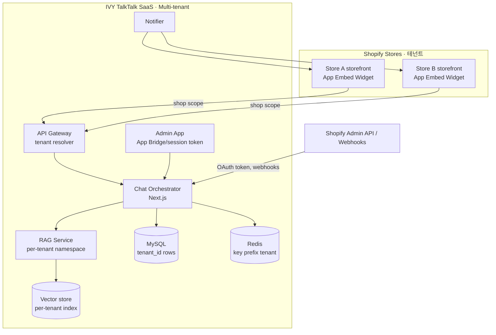
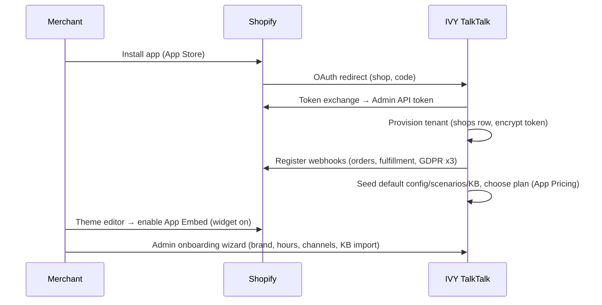

# IVY TalkTalk — Shopify Policy & Multi-Tenancy Proposal (쇼피파이 정책·멀티테넌트 서비스 방안)

목표: IVY TalkTalk를 **Shopify 스토어프론트에 위젯으로 동작**하게 하고, 단일 스토어(IVY USA)를 넘어 **다수 Shopify 상점에 SaaS(멀티테넌트)로 제공**하기 위한 정책 준수 및 아키텍처 방안을 제시한다.
(Goal: run IVY TalkTalk as a storefront widget and serve it to many Shopify stores as a multi-tenant SaaS, in compliance with Shopify app policy.)

---

## 1. Shopify Policy Findings (정책 조사 결과)

### 1.1 Distribution — Public App (배포 방식)
멀티테넌트 SaaS는 **Public App(공개앱)** 이 정답이다. Custom app은 단일 상점 전용이므로 다수 상점 서비스에 부적합. Public app은 App Store 등록·심사를 거치며, 상점별 OAuth 설치로 다중 테넌트가 성립한다.

### 1.2 Storefront Widget — Theme App Extension / App Embed Block (스토어프론트 위젯)
- 스토어프론트에 띄우는 **플로팅/오버레이 위젯(챗 버블류)** 은 **Theme App Extension의 "App embed block"** 으로 구현한다. Shopify가 공식적으로 "chat bubble apps" 같은 floating/overlay 컴포넌트를 app embed block 용도로 명시.
- App embed block은 **Vintage 테마 + Online Store 2.0** 모두 지원(섹션/JSON 템플릿 비의존) → 호환성 넓음.
- 상점 머천트가 **테마 편집기에서 토글**로 켠다(코드 수정 불필요). 위젯 JS는 가볍게 비동기 로드(스토어 렌더 블로킹 금지).
- 핵심: app embed의 Liquid에서 **shop 식별자/설정을 주입**받아, 위젯 JS가 우리 백엔드에 **테넌트 스코프로** 접속한다.

### 1.3 Authentication (인증)
- **관리자 앱(임베디드)**: Shopify Admin 내 임베드 + **App Bridge(최신)** + **세션 토큰(Token Exchange)** 인증. Built for Shopify 및 심사 요건.
- **상점 설치**: OAuth 2.0 → 상점별 **Admin API access token** 발급·저장(테넌트 키 = `shop` 도메인).
- **스토어프론트 위젯**: 공개 표면이므로 PII 직접 접근 금지. 위젯은 우리 백엔드 경유로만 주문/고객 데이터를 다루고, 고객 인증은 요구사항의 Auth Gate(Shopify 계정/소셜/게스트 주문조회, FR-006~009)로 처리.

### 1.4 Protected Customer Data (보호 고객 데이터) — **가장 중요**
- 주문상태·배송·고객 식별 기능상 **고객 PII(name/email/phone/address)** 에 접근 → **Level 2** 해당.
- Public app은 **Partner Dashboard에서 보호 데이터/필드 접근을 신청하고 심사(데이터 보호 리뷰)** 를 통과해야 한다. 미승인 필드는 `null` + `errors`로 반환됨.
- **데이터 최소수집** 원칙: 기능에 필요한 최소 필드만 신청.
- Level 1+2 의무사항(반드시 구현): 처리목적 고지·동의/옵트아웃 반영·**전송/저장 암호화**·**백업 암호화**·**테스트/운영 데이터 분리**·보존기간·**접근 로그**·최소 권한·강력 암호·**보안 사고 대응 정책**·DLP.
- 설치 수·고객 레코드 수·승인 필드 수·보존기간이 크면 데이터 보호 리뷰 표적이 됨.

### 1.5 Mandatory Compliance Webhooks (필수 GDPR 웹훅)
App Store 등재 전 **3종 필수 웹훅**을 `shopify.app.toml`(CLI)로 등록:
- `customers/data_request` — 고객 데이터 열람 요청 처리
- `customers/redact` — 특정 고객 데이터 삭제
- `shop/redact` — **앱 삭제 48시간 후** 해당 상점 데이터 전체 삭제(테넌트 오프보딩 트리거)

### 1.6 Billing (과금)
- **Shopify App Pricing(Managed)** 권장: 플랜을 제출폼에 정의하면 Shopify가 플랜 선택/청구/체험판/비례정산/업·다운그레이드를 호스팅. (Billing API recurring charge는 레거시.)
- 모델: 무료/월/연/월(연할인) + **사용량 기반(usage)** 조합 가능. (예: 대화건수·상담사 시트·알림 발송량) → SaaS 티어링에 적합. 수익은 Shopify revenue share 적용.

### 1.7 Built for Shopify / Performance (성능·품질)
- 관리자 앱: 최신 App Bridge로 임베드, **세션 토큰**, Web Vitals 수집. 목표 **LCP ≤ 2.5s, CLS ≤ 0.1**.
- 스토어프론트 위젯: 비동기·지연 로드로 스토어 렌더 영향 0 (기존 NFR-002와 합치).

---

## 2. Multi-Tenant Architecture (멀티테넌트 아키텍처)

### 2.1 Tenant Model (테넌트 모델)
- **테넌트 = Shopify 상점(shop domain)**. 모든 데이터/설정/지식/세션을 `tenant_id`로 분리.
- 신규 테이블 `shops`(=tenants): 설치 시 생성, 삭제(`shop/redact`) 시 제거.
- 격리 전략: **공유 DB + 행 단위 격리(`tenant_id` FK + 강제 필터)** 를 기본으로, 대형/엔터프라이즈 테넌트는 **스키마/DB 분리** 옵션(하이브리드).

### 2.2 Component Topology (구성)

### 2.3 Tenant Resolution (테넌트 식별)
- 위젯 요청: app embed가 주입한 `shop` + 서명된 토큰으로 게이트웨이가 `tenant_id` 해석 → 모든 다운스트림 호출에 주입.
- 관리자: 세션 토큰(JWT)의 `dest`(shop) 클레임으로 테넌트 해석.
- 웹훅: HMAC 검증 + `X-Shopify-Shop-Domain` 헤더로 테넌트 매핑.

### 2.4 Data Isolation (데이터 격리)
- **MySQL**: 모든 테이블에 `tenant_id`(= shops.id) 추가, 애플리케이션 레이어에서 **무조건 테넌트 필터**(ORM 글로벌 스코프) + 복합 인덱스(`tenant_id, ...`).
- **RAG/벡터**: 테넌트별 **네임스페이스/인덱스** 분리(지식 혼입 방지) — KB(`kb_documents.tenant_id`).
- **Redis**: 키 프리픽스 `t:{tenant_id}:...`.
- **객체 스토리지/로그**: 테넌트 경로 분리, 접근 로그(보호데이터 요건).
- **암호화**: access token·PII 전송/저장/백업 암호화(보호데이터 Level 2).

### 2.5 Onboarding / Install Flow (온보딩)

### 2.6 Per-Tenant Configuration (테넌트별 설정)
브랜드(로고/색/카피), 시나리오 버튼/FAQ, KB 소스(Knowledge Store + 상점 Google Drive), 영업시간·상담 채널(전화/이메일), 알림 채널 정책, i18n 기본 언어, 정책값(환불 기간·반품·보증·리뷰 N일·제휴율) — 모두 테넌트 스코프. (기존 FR-047 AI Setting / FR-025 Admin 확장.)

### 2.7 Integrations per Tenant (테넌트별 연동)
- **Shopify**: 테넌트별 토큰(필수).
- **Klaviyo/Odoo/Fulfillment/Google Drive**: 테넌트별 자격증명을 관리자에서 연결(BYO credentials). 미연결 시 해당 기능 비활성.
- 마케팅/트랜잭션 분리(A-8), Odoo 범위(A-7)는 테넌트 옵션으로.

### 2.8 Billing (과금)
- Shopify App Pricing로 플랜 정의: 예) Starter(월 정액·대화 N건) / Growth(시트+사용량) / Enterprise(전용 격리·SLA). 사용량 메트릭: 대화건수·상담사 시트·알림 발송량.

### 2.9 Compliance & Security (컴플라이언스·보안)
- 필수 GDPR 웹훅 3종 구현(`shop/redact` → 테넌트 데이터 완전 삭제 잡).
- 보호 고객 데이터 **Level 2 신청·심사** + 의무사항 전부 구현(암호화/분리/접근로그/사고대응/DLP/최소권한).
- CCPA(기존 NFR-004)와 데이터 처리 동의·옵트아웃을 테넌트·최종고객 양층에서 보장.
- 테넌트 간 데이터 누수 방지 테스트(격리 회귀 테스트)를 QA 필수 항목화.

---

## 3. Impact on Existing Design (기존 설계 영향)

| 영역 | 변경 |
|------|------|
| ERD | `shops`(tenants) 테이블 추가; 모든 테넌트 데이터 테이블에 `tenant_id` FK + `(tenant_id, …)` 인덱스; `integration_credentials`(테넌트별 토큰, 암호화) 추가 |
| NFR-008 | 멀티테넌시: "공유 DB+행 격리 기본, 대형 테넌트 분리 옵션"으로 구체화; 테넌트 격리 회귀 테스트 |
| 신규 NFR | 보호 고객 데이터 Level 2 준수(암호화 at rest/in transit/backup, 접근로그, 환경분리, 사고대응) |
| 신규 FR | 테넌시·권한 기본 FR-051~061은 **CHATWIDGET-RBAC**(요구사항 정의서 도메인 P)로 통합. Public-app 전환 시 추가: (FR-062) Public app OAuth 설치 플로우; (FR-063) Theme App Embed 위젯 배포; (FR-064) GDPR 필수 웹훅; (FR-065) Shopify App Pricing 과금. 테넌트 신청·승인·프로비저닝=FR-052, 온보딩 설정=FR-060 |
| 시퀀스 | SEQ-인스톨(§2.5) 추가; 모든 데이터 흐름에 tenant 스코프 표기 |
| 정책 | POL-016 테넌트 격리/보호데이터; POL-003 보존기간을 테넌트·법역별로 |
| WBS | 신규 태스크: T-041 OAuth/설치·테넌트 프로비저닝, T-042 App Embed 위젯, T-043 GDPR 웹훅, T-044 App Pricing, T-045 보호데이터 준수·격리 테스트 |

## 4. Phased Plan (단계 제안)
1. **단일 테넌트(IVY USA) 우선** — 현재 설계로 MVP 검증(Custom app 또는 단일 Public app 설치).
2. **멀티테넌트화** — `tenant_id` 도입, OAuth/프로비저닝, App Embed, GDPR 웹훅, 보호데이터 신청·심사.
3. **App Store 상장** — Built for Shopify(성능·세션토큰), App Pricing, 데이터 보호 리뷰 대응.
4. **확장** — 대형 테넌트 DB 분리 옵션, 리전/데이터 레지던시.

## 5. Risks (리스크)
- 보호 데이터 **심사 지연/반려** → 최소필드 신청·근거 명확화로 선제 대응.
- 테넌트 간 **데이터 누수** → ORM 글로벌 스코프·격리 테스트 필수.
- 위젯 **성능(스토어 영향)** → 비동기·CDN·경량 번들.
- 연동 자격증명(BYO) 관리 복잡도 → 암호화 보관·연결 상태 모니터링(기존 FR-044).

---

## Sources (출처)
- [Theme app extensions — configuration](https://shopify.dev/docs/apps/build/online-store/theme-app-extensions/configuration) · [Extend your theme with apps](https://help.shopify.com/en/manual/online-store/themes/customizing-themes/apps)
- [Work with protected customer data](https://shopify.dev/docs/apps/launch/protected-customer-data) · [Privacy law compliance](https://shopify.dev/docs/apps/build/compliance/privacy-law-compliance)
- [About billing for your app](https://shopify.dev/docs/apps/launch/billing) · [Shopify App Pricing](https://shopify.dev/docs/apps/launch/billing/subscription-billing)
- [Built for Shopify requirements](https://shopify.dev/docs/apps/launch/built-for-shopify/requirements) · [Admin, installation, and OAuth performance](https://shopify.dev/docs/apps/build/performance/admin-installation-oauth)
- [Select a distribution method](https://shopify.dev/docs/apps/launch/distribution/select-distribution-method) · [About the app review process](https://shopify.dev/docs/apps/launch/app-store-review/review-process)
